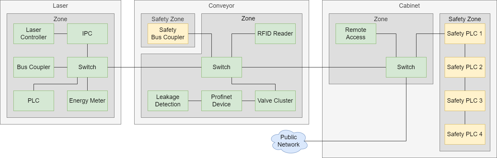

# AutoS² Automated Risk Assessment

## General Information and Status of Implementation

This repository is currently work in progress and used to display the results from the AutoS² research project and the associated dissertation. The following publications directly reference this repository:

- [INDIN 2023](https://2023.ieee-indin.org/): Determining the Target Security Level for Automated Security Risk Assessments
- [ETFA 2023](https://2023.ieee-etfa.org/): Evaluation Concept for Prototypical Implementation towards Automated Security Risk Assessments

Therefore, any feedback regarding the presented contents here in this repository are highly appreciated and can be submitted to us using the contact details from the bottom of this file.

## Introduction

Manufacturing systems based on Industry 4.0 concepts provide a greater availability of data and have modular characteristics enabling frequent changes. This raises the need for new security engineering concepts that cover the increasing complexity and frequency of mandatory security risk assessments. In contrast, the current standardization landscape used for the assessment of these systems only offers abstract, static, manual, and resource-intensive procedures. Therefore, this repository proposes a method that further specifies the IEC 62443 aiming to automate the security risk assessments in such a way that manual efforts can be reduced and a consistent quality can be achieved.

A previous analysis already revealed the following hypothesis: *If security risk assessment processes are automated for modular manufacturing systems, the required manual efforts are reduced by 20% in time and 50% in cost.*

# User Guide

This section describes how to use, test, and extend the prototypical implementation provided in this repository.

## Repository Structure

The repository consists of the following folders:

- `aas_examples` contains three Asset Administration Shells (AASs) acting as the basis for three test cases
- `doc` contains additional documentation documents
- `knowledge` contains files with the formalized expert knowledge for the automated risk assessment
- `src` contains the program code of the prototypical implementation

## Getting Started

The prototypical implementation is tested with Python 3.9.5 on a Windows and a Ubuntu Linux system. In order to execute the three example test cases, please follow the following steps:

1. Clone the repository
2. Install the required dependencies (see `src/requirements.txt`)
3. Run the file `src/main.py`

An Internet connection is required to run the examples as the implementation requests information about exemplary vulnerabilities from the [NIST NVD](https://nvd.nist.gov/) (National Vulnerability Database).

After starting the program, you can select one of the three examples (see [Documentation](#documentation)) by entering the number 1, 2, or 3 when requested. After pressing *Enter*, information about the executed steps and intermediate results are printed to the terminal window. At the end, the final results of the risk assessment are shown in the terminal window. In addition, a PDF file `Attestation.pdf` is generated and stored in the main repository folder.

## Custom Settings

- We use the MITRE ICS ATT&CK framework from within the `ics-attack-v13.1-mitigations.xlsx` file which can be downloaded [here](https://attack.mitre.org/resources/working-with-attack/).

- The mapping of technical vulnerabilities to MITRE ICS ATT&CK techniques can be adapted based on the provided expert knowledge. The proposal is following this [schema](https://github.com/center-for-threat-informed-defense/attack_to_cve) and can be changed within the `knowledge/autos2-knowledge_2023_04_06.xlsx` file.

- The mapping of Intel TAL attacker characteristics to MITRE ICS ATT&CK techniques can be adapted based on the provided expert knowledge. The proposal is explained in detail within the `INDIN 2023` publication and can be changed within the `knowledge/autos2-knowledge_2023_04_06.xlsx` file.

- The mapping of IEC 62443 SRs and FRs to MITRE ICS ATT&CK mitigations can be adapted based on the provided expert knowledge. The proposal is explained in detail within the `INDIN 2023` publication and can be changed within the `knowledge/autos2-knowledge_2023_04_06.xlsx` file.

- All settings for the prototypical implementation, such as the paths to the files with the expert knowledge, can be changed in the `src/setup.py` file.

- The number of requests per time for [NIST NVD](https://nvd.nist.gov/) (National Vulnerability Database) is limited by the server. Therefore, some CVEs from the examples are stored and accessed locally in `knowledge/example_cves.json`.

### Create your own Test Cases

In order to create a custom test case, the AASs have to follow a defined structure. All AASs of the machine, including the AASs of the modules and components, need to be stored in a single JSON file according to the three examples in the folder `aas_examples`. A machine consists of an arbitrary number of modules. The modules consist of an arbitrary number of components as shown in the following figure:

The relationship between the machine and modules is defined in the Submodel *HierarchicalStructures* (see [Additional Resources](#additional-resources)) in the AAS of the machine. Similarly, the relationship between the modules and components is defined in the Submodel *HierarchicalStructures* in the AASs of the modules. The component AASs need to contain the *MiscComponentSubmodel* with the property *SuitableForSafetyFunctions*, the CVEs, and Physical Connections of the component. In addition, each component should contain a Submodel *SecurityLevelIEC62443* with the SL-C and SL-A values.

### Open and edit AAS Examples

The used AASs are created with the [AASX Package Explorer Release 2023-03-02](https://github.com/admin-shell-io/aasx-package-explorer/releases/tag/v2023-02-03.alpha). In order to open and edit the AASs provided as JSON files, follow these steps:

1. Open the AASX Package Explorer
2. Click `File` -> `Open ..`
3. Select `AAS JSON file (*.json)` on the bottom right
4. Select one of the provided examples and click `Open`
5. Click `Workspace` -> `Edit`

After editing the files, you can save these as JSON files:

1. Click `File` -> `Save as ..`
2. Select `AAS JSON file (*.json)`
3. Save your AAS as a JSON file
4. Run the implementation and enter the number `0` when requested
5. Enter the whole path including the complete file name of your AAS and press enter

### Random SL-C and SL-A Generator

As many component manufacturers do not provide the SL-C and and SL-A values for each component yet, you can use the **Random_SL_Generator.py** located in the `aas_examples` folder. Therefore, execute the `Random_SL_Generator.py` script and follow the instructions in the command window. The script will fill all CR values inside the *SecurityLevelIEC62443* with random numbers between 0 and 4. The SL-A value for each CR is always smaller or equal to the corresponding SL-C value.

### AAS and Submodel Status

- The current versions uses AAS generated with the [AASX Package Explorer Release 2023-03-02](https://github.com/admin-shell-io/aasx-package-explorer/releases/tag/v2023-02-03.alpha). A compability to future AASs of version 3 is planned and part of the future work.

- After running the implementation, the security risk assessment results should be written to the *SecurityAssessment-* and *SecurityLevelIEC62443*-Submodels of the AASs. Those two Submodels are a result of the AutoS² research project and not standardized yet. The functionality to write the result is currently not implemented and part of the future work.

- In future, the CVEs will be provided in a [*VulnerabilityManagement*](https://interopera.de/wp-content/uploads/2022/10/2022_07_Vulnerability_Management.pdf) submodel that is currently in a standardization process.

# Documentation

## Swimlanes

To develop the abstract concepts from the IEC 62443-3-2 standard up to the degree necessarily required for automation, an analysis followed by a specification needs to be performed. This work uses a lightweight and adapted version of the Business Process Model Notation (BPMN) to collect and visualize all information mandatory for a security risk assessment within swimlanes. The result is an overview of the stakeholders, inputs, decisions, outputs, information model elements, and environmental influences in a graphical way. The main structure is represented by a pool containing the different process participants. In this case, there are six swimlanes inside the pool. Each swimlane includes one of the three process participants i.e., (1) component manufacturer, (2) system integrator, and (3) asset owner as typical industrial stakeholders, as well as (4) the information model representing the internal data for processing, (5) the security risk assessment process as the basis for the decision logic, and (6) the environment containing external data, e.g. public databases or already formalized security expert knowledge. All details can be found within the associated figure in `doc/Process_Swimlanes.png`.

## High-Level-Process

Based on the detailed process described in the swimlanes, a higher level process is created. This is the basis for the structure of the prototypical implementation:

## Network Architecture of the provided Example "CPS"

The general network architecture of the examples is shown here:

The Customizable Production System (CPS) from the [SmartFactoryOWL](https://smartfactory-owl.de/) consists of three modules (*Laser*, *Conveyor*, *Cabinet*). The modules consist of components that are safety-relevant (yellow boxes) and components that are not safety-relevant (green boxes). Based on the component characteristics, the components are grouped into Zones (grey boxes). The black lines represent the network connections.

## Example Test Cases

This repository contains three examples with different resulting risks for the assets of the module *Cabinet*.
- In Example 1, all four Safety PLCs have vulnerabilities leading to resulting risks
- In Example 2, the Safety PLC 3 has no vulnerabilities. As a result, the Safety PLC 3 is protected by the path and there is no risk. The same counts for Safety PLC 4, as it is protected by Safety PLC 3 as well
- In Example 3, none of the four Safety PLCs have vulnerabilities. As a result, there are no resulting risks

# Additional Resources

Here are some additional resources with further information for related contents:

## Related Publications for this Project

- Marco Ehrlich, Andre Bröring, Christian Diedrich, Jürgen Jasperneite, ["Towards Automated Risk Assessments for Modular Manufacturing Systems - Process Analysis and Information Model Proposal"](https://www.degruyter.com/document/doi/10.1515/auto-2022-0098), at - Automatisierungstechnik, Band 71 Heft 6, Jun. 2023.
- Marco Ehrlich, Andre Bröring, Christian Diedrich, Jürgen Jasperneite, ["Towards Automated Risk Assessments for Modular Industrial Automation and Control Systems - State of the Art Survey and Information Model Proposal"](https://www.researchgate.net/publication/360196062_Towards_Automated_Risk_Assessments_for_Modular_Industrial_Automation_and_Control_Systems_-_State_of_the_Art_Survey_and_Information_Model_Proposal), 17. Fachtagung EKA – Entwurf komplexer Automatisierungssysteme, 2022.
- Marco Ehrlich, Andre Bröring, Dimitri Hader, Torben Auhagen-Meyer, Philip Kleen, Lukasz Wisniewski, Henning Trsek, Jürgen Jasperneite, ["Alignment of safety and security risk assessments for modular production systems"](https://doi.org/10.1007/s00502-021-00927-9), e&i Elektrotechnik und Informationstechnik, Sep. 2021. 
- Marco Ehrlich, Stefan Benk, Dimitri Harder, Philip Kleen, Henning Trsek, Sebastian Schriegel, Jürgen Jasperneite, ["Automatische Bewertung und Überwachung von Safety & Security Eigenschaften – Strukturierung und Ausblick"](https://doi.org/10.1007/978-3-662-64283-2_9), Jahreskolloquium Kommunikation in der Automation, 2020. 

## Information about the AAS

- [IDTA:](https://industrialdigitaltwin.org/) General information about the AAS
- [Admin-Shell-IO:](https://admin-shell-io.com/) Information for Developers
- [Submodel HierarchicalStructures:](https://industrialdigitaltwin.org/wp-content/uploads/2023/04/IDTA-02011-1-0_Submodel_HierarchicalStructuresEnablingBoM.pdf) Documentation for the Submodel HierarchicalStructures
- References with a proposal for an AAS Integrity Verification and Version Control:
    - Andre Bröring, Marco Ehrlich, Lukasz Wisniewski, Henning Trsek, Stefan Heiss, ["Towards an Asset Administration Shell Integrity Verification Scheme"](https://doi.org/10.1109/ETFA52439.2022.9921521), IEEE 27th International Conference on Emerging Technologies and Factory Automation (ETFA), pp. 1-4, 2022.
    - Andre Bröring, Marco Ehrlich, Lukasz Wisniewski, Henning Trsek, Stefan Heiss, ["An Asset Administration Shell Version Control to Enforce Integrity Protection"](https://doi.org/10.25644/a4ws-9a49), Kommunikation in der Automation: Beiträge des Jahreskolloquiums KommA 2022, pp. 192-203, 2022.

# Contact Information

For contributions, maintenance, and feedback, please contact us:

Marco Ehrlich (*Concept and Process Description*)\
inIT - Institute Industrial IT\
Technische Hochschule Ostwestfalen-Lippe\
32657 Lemgo, Germany\
<marco.ehrlich@th-owl.de>

Andre Bröring (*Implementation*)\
inIT - Institute Industrial IT\
Technische Hochschule Ostwestfalen-Lippe\
32657 Lemgo, Germany\
<andre.broering@th-owl.de>

Any additional or supporting information is available upon request.

# Funding
This work was funded by the Ministry of Economic Affairs, Industry, Climate Action and Energy of the State of North Rhine-Westphalia within the research project "Automatic Evaluation and Monitoring of Safety & Security Properties for Intelligent Technical Systems" (AutoS²).

[Project Page Institute Industrial IT](https://www.init-owl.de/forschung/projekte/detail/automatische-bewertung-und-ueberwachung-von-safety-security-eigenschaften-fuer-intelligente-technische-systeme/) |
[Project Page it's OWL](https://www.init-owl.de/forschung/projekte/detail/automatische-bewertung-und-ueberwachung-von-safety-security-eigenschaften-fuer-intelligente-technische-systeme/)

# License
GNU General Public License v3.0

Any further information can be found within the [LICENSE](LICENSE) file.

